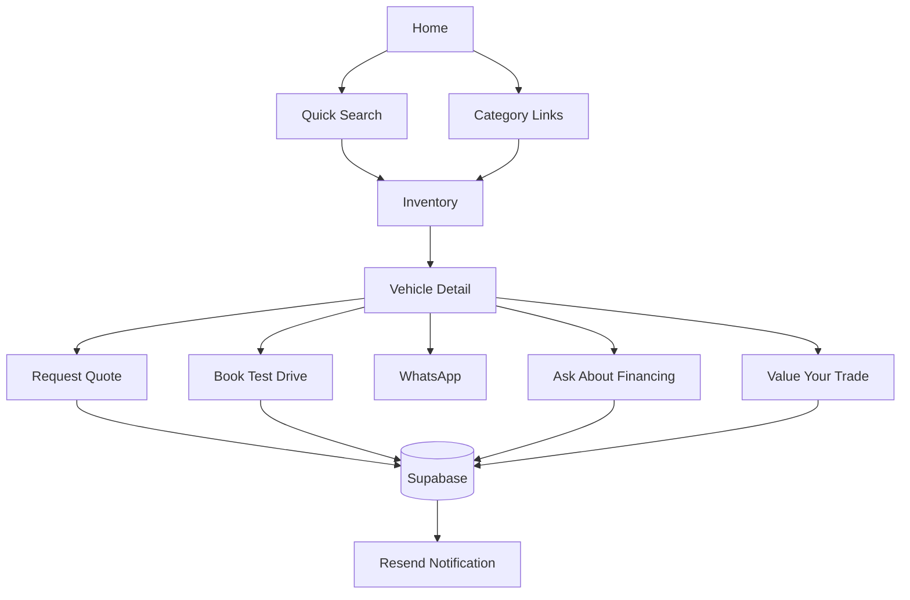

# User Flows

## Buyer Journey: Home to Inventory
1. Land on the homepage.
2. Use hero search or quick category links.
3. Browse filtered inventory results.
4. Open a vehicle detail page.
5. Choose the best-fit CTA: quote, WhatsApp, test drive, financing, or trade-in.

## Buyer Journey: Inventory to Vehicle Detail
1. Apply make, budget, year, transmission, fuel, or category filters.
2. Review vehicle cards with price, condition, location, and badges.
3. Open the most relevant listing.
4. Compare specs, images, and trust signals.

## Buyer Journey: Vehicle to Lead
1. Review vehicle overview and above-the-fold CTA stack.
2. Submit a short quote form or test drive request.
3. Alternatively click WhatsApp or call.
4. Dealership receives database lead and email notification.

## Buyer Journey: Trade-In
1. Open trade-in page or vehicle CTA.
2. Submit current vehicle basics and contact details.
3. Dealership reviews trade-in request and follows up manually.

## Admin Journey: Add Vehicle
1. Log into the admin area.
2. Open create vehicle page.
3. Fill in core vehicle fields, add image URLs or upload to Cloudinary, and set featured/status.
4. Save as draft or publish immediately.
5. Listing appears on public inventory when published.

## Admin Journey: Manage Leads
1. Open leads inbox.
2. Filter by quote, contact, financing, test drive, or trade-in.
3. Review contact details and source context.
4. Follow up outside the system.

## Flow Diagram

