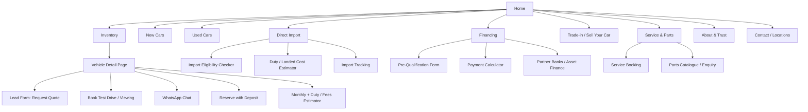
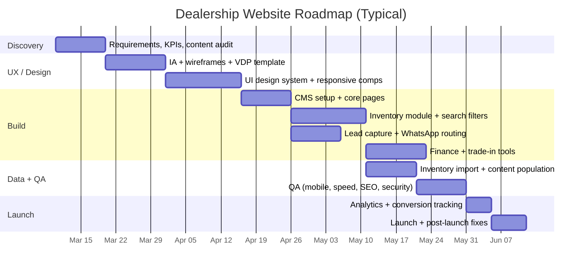

# Building a High‑Converting Car Dealership Website for Sales in Kenya

## Executive summary

A “best-in-class” dealership website for Kenya is less about glossy pages and more about **friction removal + trust**: fast mobile browsing, inventory clarity, instant chat/call, and decision tools (finance, trade‑in, duty/landed cost for imports) that match how people actually buy cars.

Key findings from market signals and competitor patterns:

- **Mobility-first reality:** Kenya’s connectivity is heavily mobile. The sector regulator reports large and growing data subscriptions, with a majority on mobile broadband and strong 4G share. That should push you toward **mobile-first UX, aggressive performance budgets, and chat-first lead capture**. citeturn24search4turn24search28turn24search12  
- **Payments + reservations matter:** **entity["company","Safaricom","telco mobile money kenya"]’s M‑PESA** reached **40 million monthly active customers** (press release dated March 6, 2026), which makes M‑PESA-supportive flows (deposit/reservation, booking fees, service bookings) strategically valuable for conversion. citeturn13search2  
- **Import decision support is a conversion lever:** Official KRA guidance indicates imported used vehicles must comply with constraints including **age limit (< 8 years from year of first registration), right-hand drive, and inspection requirements**, and KRA also publishes the tax categories payable (import duty, excise, VAT, IDF, RDL). citeturn23search0turn14search29  
- **Marketplaces are your SEO “gravity wells”:** Classifieds/inventory aggregators pull massive traffic. For example, Similarweb estimates **entity["company","Jiji Kenya","classifieds marketplace kenya"]** at roughly **2.3M visits in January 2026**, with strong organic search share—meaning you must plan to compete via long-tail SEO + listings distribution (and/or feed syndication). citeturn20view1  
- The best-performing dealership experiences combine:
  1) **Inventory search that works like a product search engine**  
  2) **Trust & proof** (inspection, warranty, transparent pricing, fraud warnings)  
  3) **Immediate contact** (WhatsApp/call + structured lead forms)  
  4) **Decision tools** (finance estimator, trade‑in valuation, import duty/eligibility checks)

## Competitive analysis of leading Kenyan dealership websites

The table below focuses on **conversion mechanics** (how each site turns browsing into leads) and **gaps** you can exploit. “Traffic signals” are included where a reputable public estimate is available; Similarweb figures are estimates. citeturn20view1turn21view0  

| Competitor | Segment | Strengths (conversion + trust) | Weaknesses / gaps to exploit | Notable features to learn from | Public traffic / SEO signals (if available) |
|---|---|---|---|---|---|
| entity["company","Kai & Karo","used car dealer marketplace kenya"] citeturn16view0 | Used cars + direct import | Strong filtering (budget bands, brand/model, location, currency), clear segmentation “Available in Kenya” vs “Direct Import”, “Sell your car” entry point. citeturn16view0 | UX can feel dense; ensure your own “quick search” is simpler while keeping advanced filters. | Multi-currency browsing + “one-two-three” process framing. citeturn16view0 | Similarweb est. **87.8K total visits** (Jan 2026), KR-heavy traffic. citeturn21view0 |
| entity["company","Carstore Kenya","used car dealer nairobi"] citeturn17view6 | Premium used | Strong trust framing: **120-point inspection**, **warranty**, finance and paperwork support including **NTSA transfer assistance**. citeturn17view6 | Often premium players underinvest in SEO at vehicle-variant level; build “model hub pages” and “ownership-cost pages” to capture organic demand. | Inspection + warranty positioned as product benefits; explicit trade-in program. citeturn17view6 | No public Similarweb estimate found in this research. |
| entity["company","Ele Cars Kenya","car import dealer kenya"] citeturn15view2 | Local stock + imports + auctions | Extremely “tool-heavy” experience: stock list, Japan auctions, import tracking, visible fraud/payment safety tips, WhatsApp contact, and an on-site assistant. citeturn15view2 | Tool sprawl can slow performance; you can win by making tools faster + more consistent across mobile. | **Fraud alert & payment instructions** and import tracking; “duty calculator” link. citeturn15view2 | No public Similarweb estimate found in this research. |
| entity["company","Cars 'R' Us Kenya","used car dealer nairobi mombasa"] citeturn15view1 | Used dealer | Inventory search filters + trade-in path + “sell here”; highlights branches and has WhatsApp widget. citeturn15view1 | Design/content feels dated; modernize UI, speed, structured data, and vehicle detail depth to outrank. | Clear “sell/trade/value my car” funnels on homepage. citeturn15view1 | No public Similarweb estimate found in this research. |
| entity["company","Toyota Kenya","vehicle distributor kenya"] citeturn17view0 | Authorized new cars | Strong brand trust; clear CTAs: **book test drive**, **trade-in request**, info request + offers. citeturn17view0 | Often less “inventory-like”; you can beat OEM sites on “available now” inventory, pricing transparency, and faster lead capture. | Trade-in and test-drive CTAs prominently available. citeturn17view0 | Similarweb company profile shows limited public web data for toyotakenya.com (may not reflect .ke). citeturn7search2 |
| entity["company","ISUZU East Africa","commercial vehicles kenya"] citeturn17view1 | Authorized commercial + pickups | Very “conversion-complete”: request quote, book service, test drive, locate dealer, download brochure, **financing calculator**. citeturn17view1 | Strong structure; your edge is better consumer UX for private buyers (total cost, trade-in, instant WhatsApp lead routing). | Dedicated “shopping tools” section incl. price list + financing calculator. citeturn17view1 | No public Similarweb estimate found in this research. |
| entity["company","Nissan Kenya","oem site kenya"] citeturn17view2 | Authorized new cars | Excellent top-nav conversion: find dealer, book test drive, request quote, book service. citeturn17view2 | Often limited used inventory presence; build SEO around “used vs new” choices and ownership costs. | Multi-CTA header (dealer/test-drive/quote/service). citeturn17view2 | No public Similarweb estimate found in this research. |
| entity["company","Subaru Kenya","oem dealer kenya"] citeturn17view3 | Authorized new + used | Mix of brand storytelling + action CTAs: book service, brochure download, used cars, and a parts shop link. citeturn17view3 | Opportunity: more transparent pricing, monthly payment examples, and “compare trims” tools. | “Used Cars” and parts shop cross-linking. citeturn17view3 | No public Similarweb estimate found in this research. |
| entity["company","Hyundai Kenya","oem dealer kenya"] citeturn17view4 | Authorized new cars | Strong CTA set: book test drive, request quote, brochure, book service; clear dealer contact and location. citeturn17view4 | Often wins on brand queries only; build non-brand SEO (best family SUV under X, etc.). | Consistent lead-entry CTAs across the site. citeturn17view4 | No public Similarweb estimate found in this research. |
| entity["company","Mercedes-Benz Kenya","oem dealer kenya"] citeturn18view3 | Premium authorized | Premium brand experience; test drive, brochure, service booking; “find dealer” path. citeturn18view3 | Typically weak on price transparency; an independent dealer can win with value proof + total cost models. | Service & dealership discovery integrated into navigation. citeturn18view3 | No public Similarweb estimate found in this research. |
| entity["company","Autochek","auto marketplace africa"] citeturn17view5 | Marketplace + finance | Inventory at scale with filters and built-in finance flows (“Apply for loan”, monthly estimates, “Pay full cash”). citeturn17view5 | Marketplaces can feel less trustworthy; you can differentiate with inspection proof, guarantees, and more human contact. | Finance-first listing UX: monthly payment visuals + loan CTA. citeturn17view5 | No public Similarweb visit estimate captured here (AI-traffic page was found, but not full traffic). citeturn7search1 |
| entity["company","Cheki Motors","auto listing website kenya"] citeturn17view7 | Marketplace/listings | Location browsing; strong positioning as an auto listing hub. citeturn17view7 | Listing sites often leak leads; as a dealer site, capture leads with stronger CTAs + trust + financing. | Clear “browse by location” taxonomy. citeturn17view7 | Similarweb competitor linkage exists, but no clean standalone visit estimate captured here. citeturn6search4 |
| entity["company","Ford Kenya","oem dealer kenya"] citeturn18view2 | Authorized new cars | Dealer locator + book test drive/service + request quote + brochure access. citeturn18view2 | Opportunity: “available now” stock pages and local SEO landing pages by county. | Multiple CTAs packaged as “benefits” blocks. citeturn18view2 | No public Similarweb estimate found in this research. |

Screenshot-style references (useful for visual benchmarking of layouts, hero sections, and inventory search patterns):

image_group{"layout":"carousel","aspect_ratio":"16:9","query":["Kai and Karo Kenya website screenshot","Carstore Kenya website screenshot Rosslyn Riviera Mall","Isuzu East Africa Kenya website screenshot financing calculator","Toyota Kenya website screenshot book a test drive","Ele Cars Kenya website screenshot Japan auctions import tracking"],"num_per_query":1}

Competitive patterns to copy (and improve):
- **Single-purpose CTAs** (“Request a Quote”, “Book Test Drive”, “Book Service”) appear repeatedly on top OEM sites like Isuzu, Nissan, Hyundai. citeturn17view1turn17view2turn17view4  
- **Trust stacks** (inspection, warranty, paperwork help) are highlighted by premium used dealers. citeturn17view6  
- **Import-specific tooling** (auctions, tracking, fraud warnings) is becoming a differentiator among import dealers. citeturn15view2  

## Recommended website structure and conversion UX for Kenyan buyers

A high-conversion site in this market should assume:
- Many sessions start on mobile broadband and may be price-sensitive; regulator statistics show strong mobile data growth and high mobile broadband share. citeturn24search4turn24search28turn24search12  
- Buyers frequently ask: “What is the monthly?” and “What is the all-in cost (duty/transfer)?”—because import rules/taxes and paperwork can be confusing. KRA provides official tax categories and import procedure constraints. citeturn23search0turn14search29  
- “Instant messaging commerce” matters. Meta’s own documentation supports running “ads that click to WhatsApp,” which aligns with how many Kenyan buyers prefer to engage quickly. citeturn13search11turn13search8  

Recommended information architecture (IA):

UX and conversion features that are specifically high-impact in Kenya:

1) Inventory search that behaves like a product search engine  
Implement:
- Fast filters: make, model, body type, year, mileage, engine size, transmission, location, budget bands.
- “Available now” vs “incoming/import pipeline” segmentation (Kai & Karo and import dealers do variants of this). citeturn16view0turn15view2  
- Vehicle cards must show: price (KES), location, mileage, deal badge (e.g., “Certified”, “Warranty”), and 1‑tap WhatsApp/call.

2) Vehicle detail pages designed for trust + action  
A strong Kenyan VDP should include:
- Verification signals: inspection report, service history, chassis/VIN handling policy, logbook/transfer guidance.
- Warranty/after-sales: “what’s covered”, claim process, service network (Carstore makes warranty and full transfer support a headline benefit). citeturn17view6  
- CTAs stacked in priority order: WhatsApp, call, request quote, book viewing/test drive, reserve.

3) Financing UX that is not “just a calculator”  
Competitors show that finance is a core conversion mechanic (Isuzu provides a financing calculator; Autochek shows visible monthly estimates and “Apply for loan”). citeturn17view1turn17view5  
Recommended:
- A monthly payment widget on every VDP (with sliders for deposit/tenor).
- A “Get pre-qualified” form (short and mobile-friendly).
- Clear finance partners list (e.g., asset finance banks are shown by Simba’s motor division). citeturn19view0  

4) Trade-in and “sell your car” as a parallel acquisition channel  
Trade-in flows are common among serious dealers (Toyota provides trade-in request; Carstore and Cars ‘R’ Us promote trade-in). citeturn17view0turn17view6turn15view1  
Recommended:
- A “Value my car” flow: plate/VIN (optional), make/model, year, mileage, photos, location, outstanding finance.
- Instant “estimated range” + human follow-up.

5) Import tools: eligibility + duty/fees clarity  
Because KRA indicates used imported vehicles must be < 8 years from year of first registration, RHD, and subject to inspection, you can reduce buyer anxiety by embedding these checks. citeturn23search0  
Also include a duty explainer based on KRA’s published tax items (import duty, excise, VAT, IDF, RDL). citeturn14search29turn23search0  
For extra trust, reference KEBS-related document validation realities: KEBS has issued notices about document validation for age-limit compliance (including published fee and timelines in at least one 2025 notice). citeturn23search1  

6) Payments and booking deposits  
Given the scale of M‑PESA usage (40 million monthly active customers), offer a low-friction way to reserve/hold a vehicle (refundable deposit policy clearly stated). citeturn13search2  
For implementation, Safaricom’s Daraja portal is the official gateway for M‑PESA APIs used in web/mobile payment integrations. citeturn14search0turn14search3  

7) WhatsApp-first contact and lead routing  
Use:
- A fixed “WhatsApp us” button (and per-vehicle prefilled message: “Hi, is STOCK#123 still available?”).
- Click-to-WhatsApp ad landing experiences (Meta provides official guidance for ads that click to WhatsApp). citeturn13search11turn13search8  

8) Multilingual content
Default: English with an optional Kiswahili toggle for high-intent pages (inventory, financing terms, trade-in requirements, FAQs). Not all sites do this well; it’s a defensible differentiation.

## Tech stack options with pros, cons, and realistic cost ranges

The right stack depends on your inventory complexity (50 cars vs 2,000 cars), whether you do auctions/import tracking, and how tightly you want finance + CRM automation.

A practical comparison:

| Option | Best for | Pros | Cons | Typical cost bands (Kenya market reality) |
|---|---|---|---|---|
| entity["company","WordPress","open source cms"] + inventory plugin/custom post types + entity["company","WooCommerce","ecommerce plugin wordpress"] (optional) + premium theme | Most dealers (fastest time-to-market) | Huge talent pool; strong SEO; fast to ship with car-dealer themes (ThemeForest shows many and frequent updates). citeturn10search2turn11search2 | Can become slow/insecure if overloaded with plugins; dealer themes may be heavy; inventory data model needs discipline. | Build: ~KES 80k–600k+ depending on inventory + custom features (aligned with published Kenya pricing ranges). citeturn9search3turn9search22turn9search30 |
| entity["company","Webflow","website builder cms"] CMS + custom inventory collections | Design-led brands; small-to-mid inventory; marketing-heavy | Very strong design control; structured CMS; templates for car sites exist; official pricing is transparent. citeturn10search7turn11search3 | CMS item limits / scaling; complex inventory search often requires custom code or external search; ongoing plan costs. | Build: ~KES 150k–900k+; ongoing hosting per plan. citeturn11search3turn11news42turn11news40 |
| “Hybrid headless” (custom frontend + headless CMS + search) | Large inventory + high performance + custom calculators | Best speed/scalability; clean data model; easier integration with CRM/finance; strong long-term platform | Higher upfront cost; needs real engineering discipline; longer delivery | Build: ~KES 600k–3M+ depending on integrations; ongoing devops. (Use when inventory/search + tools are core product.) citeturn9search22turn9search30 |
| Marketplace-first strategy + lightweight dealer site | Dealers who rely on Autochek/Cheki/Jiji for demand | Faster early traction; reduces need to win SEO immediately; aligns with marketplace demand gravity (e.g., Jiji traffic scale). citeturn20view1 | Lower brand control; lead leakage; platform policy risk; long-term CAC can rise | Build site: ~KES 50k–250k; budget shifts to listings + ads. citeturn9search30turn20view1 |

Core integrations to plan (independent of stack):
- Payments: **entity["company","M-PESA","mobile money kenya"]** via **entity["company","Safaricom Daraja","mpesa api platform"] (official portal). citeturn14search0turn14search3  
- Analytics: GA4 + events for “WhatsApp click,” “Call click,” “Lead form submit,” “Reserve deposit,” “Finance prequal submit.”  
- CRM: route all leads into one system with source attribution (SEO vs classifieds vs ads).  
- WhatsApp: per-branch routing and SLAs; optionally automation for first response.

## Where to get a full design + build in Kenya and beyond

Below is a sourcing shortlist that covers local agencies, regional options, global templates, and freelancers. Pricing/time are indicative and should be validated by quotes; the ranges are grounded in publicly posted Kenya packages and typical marketplace pricing.

| Source type | Vendor / marketplace | Strengths | Typical pricing signals (public) | Typical delivery time | Support model / notes |
|---|---|---|---|---|---|
| Local Kenya agency | entity["company","Zilojo","digital agency nairobi"] citeturn9search0turn9search12 | Higher-end creative + web development; good if you want brand + campaigns | Pricing not publicly standardized in sources reviewed; positioned as full-service. citeturn9search0turn9search4 | 6–14+ weeks typical for agency work | Best when you want brand + media + ongoing marketing under one roof. |
| Local Kenya agency | entity["company","KWETU Marketing Agency","web design nairobi"] citeturn9search3 | Public package pricing; WordPress builds; useful benchmark | Example packages include Basic/Premium/Elite with KES pricing. citeturn9search3 | Their page references 14 working days for some packages. citeturn9search3 | Package scope must be checked (inventory/search often becomes “custom”). |
| Local Kenya specialty claim | entity["company","Niche Web Creation","web dev kenya"] citeturn9search9 | Explicitly markets “car dealer website design Kenya” | No clear public pricing in the viewed excerpt. citeturn9search9 | Likely 4–10 weeks depending scope | Validate portfolio + performance + SEO deliverables. |
| Local Kenya specialty claim | entity["company","DevOps Web Designers","web design nairobi"] citeturn9search13turn9search30 | Mentions inventory systems + CRM; also publishes cost ranges | Public cost ranges for site types and related line items (hosting/SEO). citeturn9search30 | 4–10 weeks depending scope | Ensure devops/security competence is real (not only branding). |
| Local Kenya freelancer/solo studio | entity["company","Nelson The Great Design","web designer kenya"] citeturn9search25 | Shows an automotive portfolio item (“car dealer website… with vehicle inventory”) | Pricing not posted in cited page; negotiate | 2–8 weeks typical | Risk/benefit: cheaper, but continuity depends on one person. |
| Regional directory option | entity["company","Clutch","b2b ratings platform"] lists Kenya/EA firms citeturn9search19turn10search0turn10search1 | Easier vendor comparison with filters (location, rates, team size) | Listings show $/hr bands and minimums for some profiles. citeturn9search19turn10search0turn10search1 | Varies | Use for shortlist + due diligence; still do reference checks. |
| Global templates | entity["company","ThemeForest","website template marketplace"] citeturn10search2turn11search2 | Large selection of car-dealer themes; frequent updates; low cost per theme | Example car dealer themes priced in the ~$19–$89 range; “Motors” is a known option. citeturn10search2turn11search2turn10search14 | Template setup: 1–3 weeks; customization: 3–8+ weeks | Biggest risk: theme bloat + slow performance; budget for optimization. |
| Global templates | entity["company","Webflow","website builder cms"] templates/galleries citeturn10search7turn10search3turn10search23 | Strong starting point for premium design; cloneable examples | Dependent on Webflow plan costs. citeturn11search3 | 2–6 weeks typical | Great for marketing sites; complex inventory may need custom work. |
| Freelancers | entity["company","Upwork","freelance marketplace"] citeturn11search0 and entity["company","Fiverr","freelance marketplace"] citeturn11search1 | Bandwidth and selection; can hire designers + WP devs + SEO separately | Fiverr publishes average WordPress job cost figures; Kenya freelancer rate ranges also published by local hosts. citeturn11search1turn11search7 | 1–8 weeks depending scope | Requires stronger project management on your side (scope control + QA). |

## Implementation roadmap and budget tiers

Roadmap (features-first, conversion-first). This is the sequence that reduces risk:

Budget tiers (KES). These ranges are aligned with publicly posted Kenya package pricing and cost breakdown examples; your actual quote will depend on inventory scale and integrations. citeturn9search3turn9search22turn9search30turn9search15  

| Tier | Who it fits | What you ship | Timeline | Ballpark budget |
|---|---|---|---|---|
| Basic | Small dealer (≤50 vehicles), needs credibility + leads fast | Mobile-first marketing site, basic inventory listing, WhatsApp/call, lead forms, basic on-page SEO, analytics events | ~3–5 weeks | ~KES 80k–250k (fits many published low-mid packages as baseline, plus inventory setup). citeturn9search3turn9search30 |
| Standard | Serious dealer (50–300 vehicles), wants higher conversion | Advanced filters, structured VDPs, finance estimator, trade-in form, better content strategy, local SEO landing pages, CRM integration | ~6–10 weeks | ~KES 250k–900k (often “custom website” band). citeturn9search30turn9search22 |
| Premium | Large inventory / importer (300–2,000+), tools are the product | High-performance search, import eligibility + duty/fees tools, structured automation, audit logs, multi-branch routing, advanced analytics, deep SEO program | ~10–16+ weeks | ~KES 900k–3M+ (agency/custom build range). citeturn9search22turn9search15 |

Budget realism check (common hidden costs):
- Hosting, SSL, domain, and maintenance are often separate; published Kenya cost breakdowns show typical annual hosting/domain bands and ongoing maintenance/SEO ranges. citeturn9search30turn9search22  
- A “car dealer theme” is cheap, but performance optimization and inventory UX are what you actually pay for. Theme marketplaces show low template sticker prices, which can mislead budgeting. citeturn10search2turn11search2  

## SEO and digital marketing starter plan for the Kenyan market

The goal is to build a lead engine that doesn’t rely only on paid ads or only on classifieds.

Local SEO foundation (Weeks 1–3)
- Create/claim and verify your Google Business Profile (GBP). Google notes that verification options depend on the business and region, and you may need more than one method. citeturn13search0  
- Fill GBP fully and keep it accurate; Google explicitly states complete, accurate profiles are more likely to show for relevant local queries. citeturn13search1  
- Build location landing pages (not spam): “Car dealer in [area]”, “Used cars in [county]”, plus map embeds, hours, and contact routes.

Inventory SEO (Weeks 2–8)
- Indexable vehicle pages with consistent schema + internal linking.
- “Model hub” pages (e.g., “Toyota Harrier in Kenya: trims, common issues, fuel economy, price bands”) that target long-tail queries marketplaces often miss.
- Add ownership cost content aligned to KRA realities (import tax categories, procedures). Use official KRA explainers where possible. citeturn23search0turn14search29  

Classifieds + marketplace distribution (Weeks 1–ongoing)
- List on major platforms and treat them as top-of-funnel. Similarweb estimates indicate classifieds can dwarf dealer sites in raw traffic (e.g., Jiji). citeturn20view1  
- Use tracking links/UTMs so leads are attributed correctly.

Paid acquisition that matches local behavior (Weeks 2–ongoing)
- Run Meta “click to WhatsApp” campaigns for high-intent inventory (SUVs, vans, pickups). Meta provides official instructions for creating ads that click to WhatsApp, and WhatsApp Business documents the product concept. citeturn13search8turn13search11  
- Landing experience: for each ad, deep link to a VDP with prefilled WhatsApp message + backup lead form.

Trust marketing (Ongoing)
- Publish inspection process, warranties, and paperwork support prominently (a differentiator used by Carstore). citeturn17view6  
- If you do imports, publish “import eligibility” guidance and document validation steps; KEBS has published notices on document validation for age-limit verification. citeturn23search1turn23search18  

Measurement (non-negotiable)
- Track: inventory views → WhatsApp clicks → calls → form submits → booked viewings → closed sales.
- Connect call tracking and WhatsApp lead tagging wherever possible.

## Security, legal, and compliance notes relevant to Kenya

This section summarizes high-impact obligations and design implications. It is not legal advice.

Data protection and privacy
- Kenya’s **Data Protection Act (No. 24 of 2019)** establishes rights/obligations and the regulator (ODPC). citeturn12search4turn12search8  
- ODPC states that registration of data controllers and processors is required under Section 18 of the Act and the Data Protection (Registration of Data Controllers and Data Processors) Regulations, with registration commencing July 14, 2022 via the ODPC portal. citeturn12search9turn12search13turn12search17  
Implications for your website:
- Publish a clear privacy notice (what data you collect in lead forms, why you collect it, retention, sharing with finance partners).
- Add consent mechanisms for marketing follow-ups (especially if doing WhatsApp/SMS campaigns).
- Ensure lead data storage, access control, audit logs, and breach response planning (Kenyan regulations include breach notification concepts in the data protection framework). citeturn12search13turn12search0  

Consumer protection and sales practices
- The **Consumer Protection Act** provides for protection of consumers and prevention of unfair trade practices. citeturn12search2turn12search6  
Practical website implications:
- Avoid misleading price claims (e.g., “from” pricing that excludes mandatory fees without disclosure).
- Clearly publish warranty/return policies, condition disclaimers for used vehicles, and what “certified” means if you use that wording.

Cybersecurity and incident readiness
- Kenya’s **Computer Misuse and Cybercrimes Act, 2018** is central cybercrime legislation. citeturn12search3turn12search7  
- There is also a **Computer Misuse and Cybercrimes (Amendment) Act, 2025** (published October 2025). citeturn12search19  
Website implications:
- Implement baseline controls: MFA for admins, WAF/CDN, least-privilege access, secure backups, patching SLAs, fraud monitoring for payment instructions.

Vehicle import rule communication (high trust impact)
- KRA’s import procedure guidance includes constraints such as **< 8 years from year of first registration**, RHD, and inspection requirements; this should be reflected in any “import with us” marketing to avoid misleading users. citeturn23search0  
- KEBS has published notices reinforcing the age-limit framework and operational steps like document validation for destination inspection cases. citeturn23search1turn23search18  

Unspecified / needs specialist confirmation (explicitly not fully validated here)
- Whether your specific dealership must register with ODPC depends on how you qualify as a data controller/processor and what data you process; consult counsel or ODPC guidance for your exact case. citeturn12search9turn12search5  
- Any sector-specific advertising standards beyond the Consumer Protection Act (e.g., restrictions on financing advertising disclosures) were not exhaustively researched in this report; treat as unspecified pending legal review.